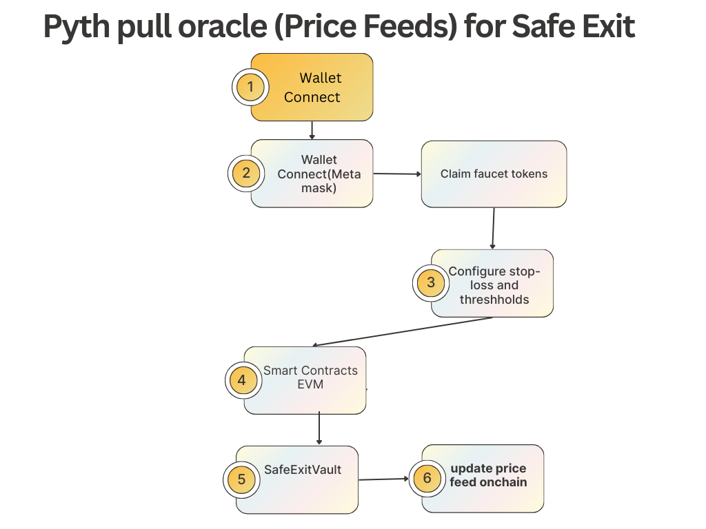
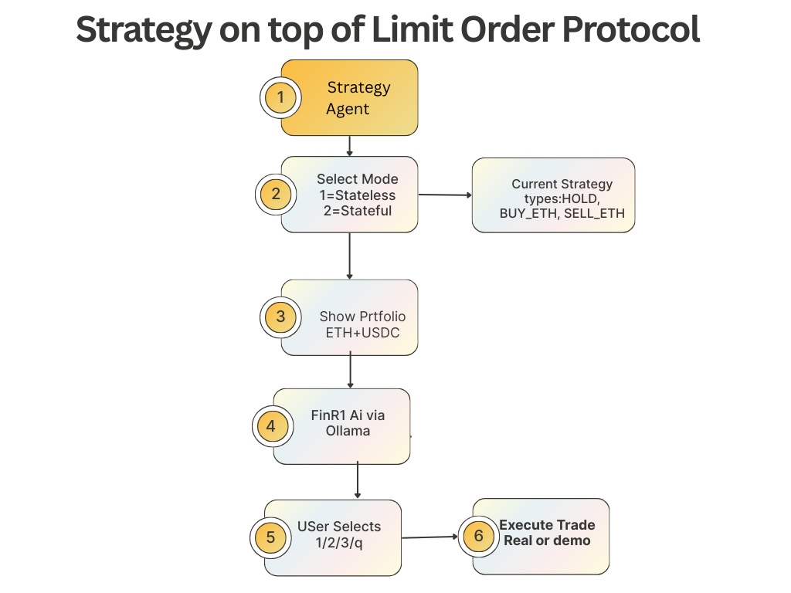

# Agentic-DeFi

## Introduction

Welcome to **Agentic-DeFi** — a revolutionary decentralized finance platform that bridges the gap between artificial intelligence and blockchain technology. This cutting-edge project demonstrates the future of autonomous financial systems, where AI agents orchestrate complex DeFi operations with unprecedented efficiency and intelligence.

### 🚀 What Makes Agentic-DeFi Special?

**Agentic-DeFi** represents a paradigm shift in how we think about decentralized finance. By combining advanced AI agentic workflows with robust blockchain infrastructure, we've created a platform that can:

- **Think and Act Autonomously**: Our AI agents analyze market conditions, execute trades, and manage risk without human intervention
- **Scale Infinitely**: Built on Fluence's distributed infrastructure, our system scales seamlessly across a global network of virtual servers
- **Trust the Data**: Integrated with Pyth Network's institutional-grade price feeds for accurate, real-time market data
- **Trade Intelligently**: Leveraging 1inch's Limit Order Protocol for sophisticated, automated trading strategies

### 🎯 Our Vision

We envision a world where DeFi protocols are not just smart contracts, but truly intelligent systems that can adapt, learn, and optimize themselves in real-time. Agentic-DeFi is our proof-of-concept for this future — demonstrating how AI agents can manage complex financial operations with the reliability and security that DeFi demands.

### 🔧 Technical Excellence

This project showcases the seamless integration of three cutting-edge technologies:
- **Fluence Virtual Servers**: CPU-optimized distributed computing for cost-effective AI inference
- **Pyth Network**: Real-time, institutional-grade price feeds for accurate market data
- **1inch Protocol**: Advanced limit order execution for sophisticated trading strategies

### 🌟 Impact & Innovation

Agentic-DeFi isn't just another DeFi project — it's a glimpse into the future of autonomous financial systems. By demonstrating efficient AI-powered workflows on decentralized infrastructure, we're paving the way for more accessible, robust, and intelligent DeFi services that can serve users 24/7 with superhuman efficiency.

---

*Ready to explore the future of DeFi? Let's dive into the technical architecture and see how we've built this revolutionary platform.*

## Architecture Overview



- **Backend**: Node.js/TypeScript API server orchestrating agentic logic, price feed integration, and trading strategies.
- **Frontend**: React + Vite web interface for monitoring, configuration, and demo interactions.
- **Smart Contracts**: Solidity contracts for on-chain price updates, limit order execution, and agent coordination.
- **Fluence Virtual Servers**: All AI and backend services are deployed on CPU-only Fluence VMs for cost-effective, scalable inference.
- **Pyth Network**: Real-time price feeds are fetched via the Pyth Pull Oracle and updated on-chain for secure, reliable data.
- **1inch Protocol**: Advanced limit order strategies and hooks are built atop the 1inch Limit Order Protocol.

## Sponsors & Why We Used Them

### Fluence

**Why did we use it?** Fluence provides CPU-only virtual servers, enabling efficient deployment of AI agents and inference APIs without GPU requirements. This aligns with the hackathon’s goal of demonstrating impactful, resource-efficient AI on Fluence VMs. It allows us to build scalable, cost-effective agentic backends and inference APIs. The decentralized nature of Fluence also enhances reliability and censorship resistance for DeFi applications.

**Impact:** By leveraging Fluence, our project demonstrates how advanced AI and agentic workflows can be run efficiently on distributed infrastructure, paving the way for more accessible and robust DeFi services.

 Fluence Virtual Servers — Prize Submission

## What it does: Project Purpose and Overview

Agentic-DeFi leverages Fluence Virtual Servers to deploy AI-powered agentic backends for decentralized finance. The backend runs entirely on CPU-only Fluence VMs, orchestrating autonomous agents that analyze market data, interact with smart contracts, and execute trading strategies. This demonstrates how efficient, scalable AI can be achieved without GPUs, using distributed infrastructure.

## How to set it up: Full Setup Instructions

1. **Provision a Fluence VM**
  - Follow Fluence documentation to create a CPU-only VM.
  - Note the VM ID and public endpoint.
2. **Clone the repository**
  ```powershell
  git clone <private-repo-url>
  cd Agentic-DeFi
  ```
3. **Install backend dependencies**
  ```powershell
  cd backend
  npm install
  ```
4. **Configure environment variables**
  - Copy `backend/.env.example` to `backend/.env` and fill in required secrets.
5. **Deploy backend to Fluence VM**
  - Use provided Terraform/Ansible scripts in `scripts/` for automated deployment, or follow manual steps in `backend/README.md`.
  - Ensure required ports are open for API access.
6. **Verify deployment**
  - Access the backend API at `http://<fluence-vm-endpoint>:<port>`.

## How to run it: Runtime Guidance and Usage Steps

1. **Start backend on Fluence VM**
  ```powershell
  npm run start
  ```
2. **Monitor logs**
  - Use SSH or Fluence dashboard to view logs and agent activity.
3. **Interact with API**
  - Use Postman, curl, or the frontend to call backend endpoints.
  - Example: `GET /api/pyth/price?symbol=ETHUSD` returns latest price feed.

## Examples: Demo Inputs/Outputs, Screenshots, API Calls

[Link Text](http://81.15.150.160:3000/health)
### Pyth Network

**About Pyth Network:** Pyth is a leading oracle network that delivers high-frequency, real-time price data from institutional sources directly to blockchains. Its Pull Oracle model allows dApps to fetch and update price feeds on demand, ensuring accuracy and minimizing latency. Pyth supports a wide range of assets and is integrated with major DeFi protocols.

**Why did we use it?** Pyth’s Pull Oracle allows our dApp to fetch real-time price feeds, update them on-chain, and consume them for trading and risk management. This enables innovative DeFi use cases and meets the requirements for the Pyth prize. Pyth is essential for secure, reliable, and up-to-date price data in our agentic workflows. The flexibility of the Pull model also allows us to optimize costs and update frequency based on our needs.

**Impact:** Integrating Pyth enables our agents and smart contracts to make informed decisions using trusted, up-to-date market data, improving the safety and efficiency of DeFi strategies.

**Prize:** Top three teams with best and most innovative use of Pyth Price feeds.

### 1inch

**About 1inch:** 1inch is a leading decentralized exchange aggregator and protocol, known for its Limit Order Protocol that enables highly customizable and efficient order execution on-chain. The protocol supports advanced order types, hooks, and composable strategies, making it a powerful tool for building innovative DeFi applications.

**Why did we use it?** The 1inch Limit Order Protocol is leveraged to build advanced trading strategies and hooks, enabling flexible, programmable order execution and agentic trading logic. It provides the foundation for innovative, automated DeFi strategies and meets the requirements for the 1inch prize. The protocol’s extensibility allows us to implement custom agentic logic and integrate seamlessly with our backend and smart contracts.

**Impact:** By building on 1inch, our project showcases new possibilities for automated, agent-driven trading and liquidity management, pushing the boundaries of what’s possible in DeFi.

**Prize:** For the most innovative and complete strategies built on top of the Limit Order Protocol.

## Setup Instructions


### 1. Clone the repository (private until submission)
```powershell
git clone <private-repo-url>
cd Agentic-DeFi
```

### 2. Install dependencies
#### Backend
```powershell
cd backend
npm install
```
#### Frontend
```powershell
cd ../frontend
npm install
```

### 3. Configure environment variables
- Copy `.env.example` to `.env` in both `backend/` and `frontend/` folders.
- Fill in required secrets and API keys (see comments in `.env.example`).
- For smart contract deployment, set RPC URLs and private keys as needed.

### 4. Build and deploy smart contracts
- Navigate to `strategy/on-chain/` and follow deployment instructions in the contract README.
- Use provided scripts or Hardhat/Foundry commands to deploy contracts to your target EVM chain.

### 5. Deploy backend on Fluence VM
- Use provided Terraform/Ansible scripts in `scripts/` for automated deployment.
- Alternatively, follow manual deployment steps in `backend/README.md` to launch the backend on a Fluence VM.
- Ensure the VM is configured for CPU-only workloads and open required ports for API access.

### 6. Start backend locally (for development)
```powershell
cd backend
npm run dev
```

### 7. Start frontend
```powershell
cd frontend
npm run dev
```

### 8. Verify deployment
- Access the frontend at `http://localhost:5173` (or configured port).
- Test backend API endpoints using Postman, curl, or the frontend UI.
- Check smart contract status and logs on your target EVM chain.

### 9. Troubleshooting
- If you encounter issues, check logs in `backend/` and `frontend/` folders.
- Ensure all environment variables are set and valid.
- For VM deployment, verify network/firewall settings and resource allocation.

## How to Run


### Backend
- Deployed on Fluence VM for production, or run locally for development.
- Exposes REST API endpoints for agentic workflows, price feeds, and trading.
- Example: `GET /api/pyth/price?symbol=ETHUSD` returns latest price feed.

### Frontend
- Run locally or deploy to a static host.
- Connects to backend API for demo, monitoring, and agent management.
- Example: Access dashboard at `http://localhost:5173`.

### Smart Contracts
- Deploy using provided scripts in `strategy/on-chain/`.
- Interact via backend API, CLI scripts, or directly on-chain.
- Example: Use `updatePriceFeeds` method to update price data.

### End-to-End Flow
1. Agents fetch price data from Pyth via backend.
2. Backend updates price on-chain using smart contracts.
3. Agents analyze data and trigger limit order strategies via 1inch hooks.
4. Frontend displays status, logs, and results for monitoring and management.

## Examples

- **Price Feed Pull**: Fetch price from Hermes, update on-chain, and consume in trading logic.
- **Limit Order Strategy**: Create, update, and execute advanced limit orders via 1inch hooks.
- **Agentic Workflow**: AI agent analyzes market data, triggers on-chain actions, and manages risk.

## Licensing

This project is licensed under the MIT License. See `strategy/LICENSE` for details.
# Agentic DeFi — Restructured into trees/branches/childs